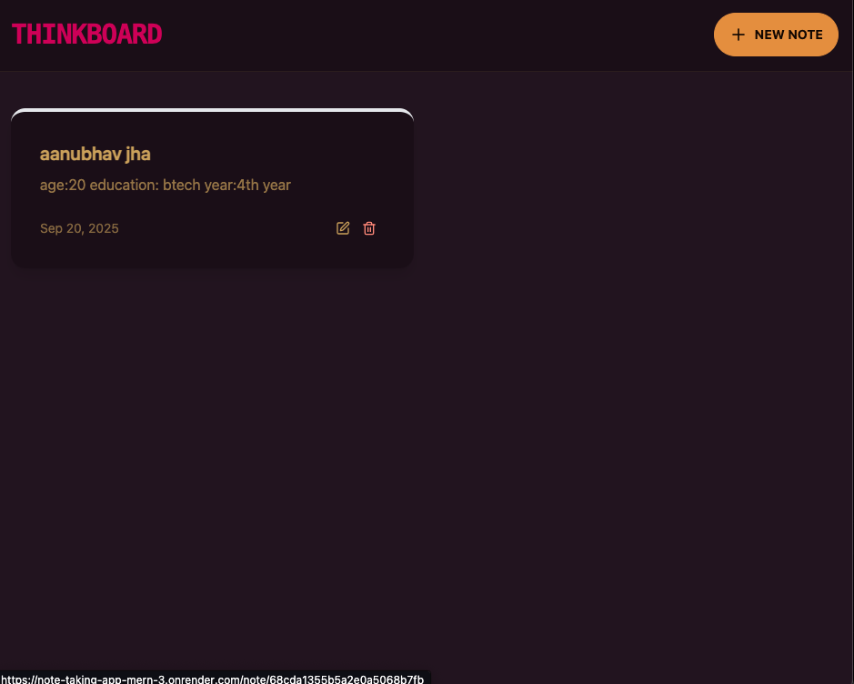
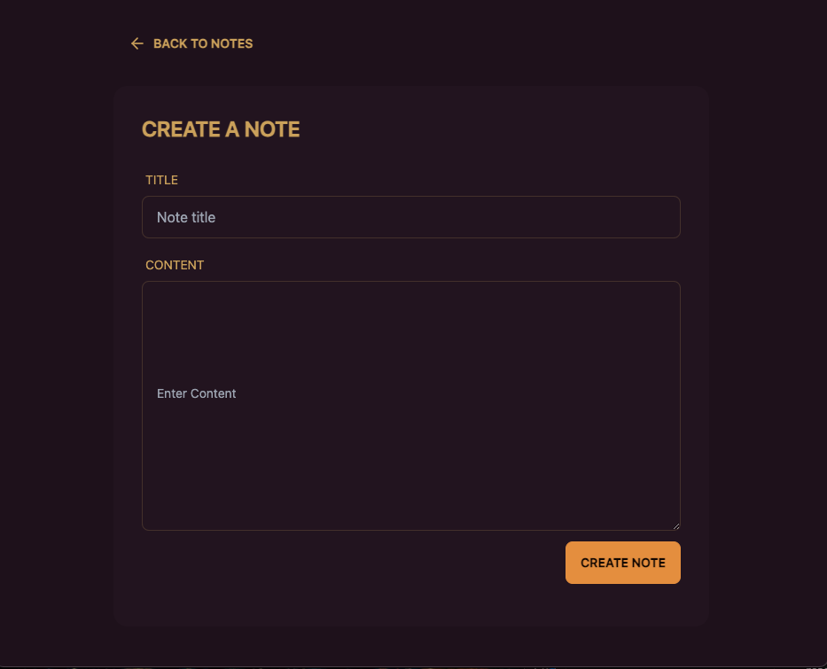
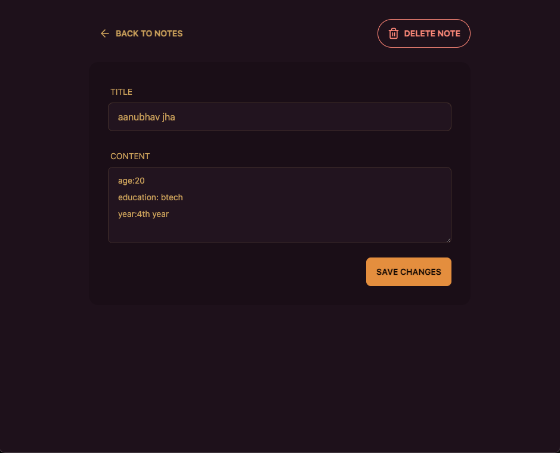

project demo:https://note-taking-app-mern-3.onrender.com/


(refresh the site if it shows..."no notes available"....because the backend api may take some time to load after opening the link)


# 📝 Notetaking App (MERN)

A full-stack notetaking app built with MongoDB, Express, React, and Node.js.  
Includes authentication and rate limiting with Redis.

## 🚀 Live Demo
[Click here](https://note-taking-app-mern-3.onrender.com/)

## 📸 Screenshots

### Home Page


### Create Page


### Delete page


## ⚙️ How to Run Locally
```bash
git clone https://github.com/aanubhavjha27/NOTE_TAKING_APP_MERN.git
cd backend
npm install
npm run start
